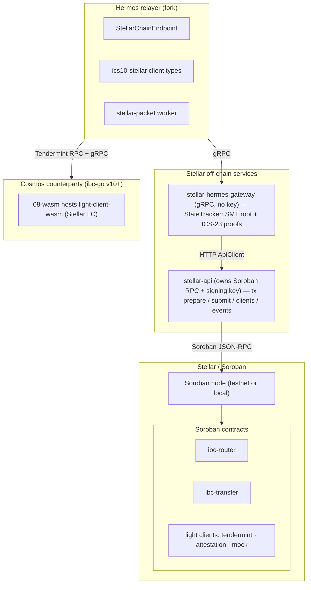
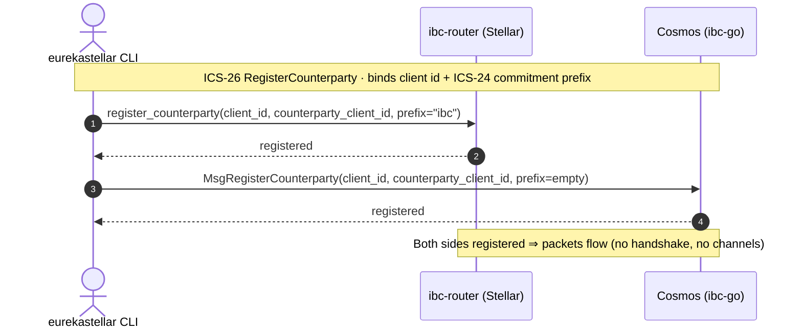
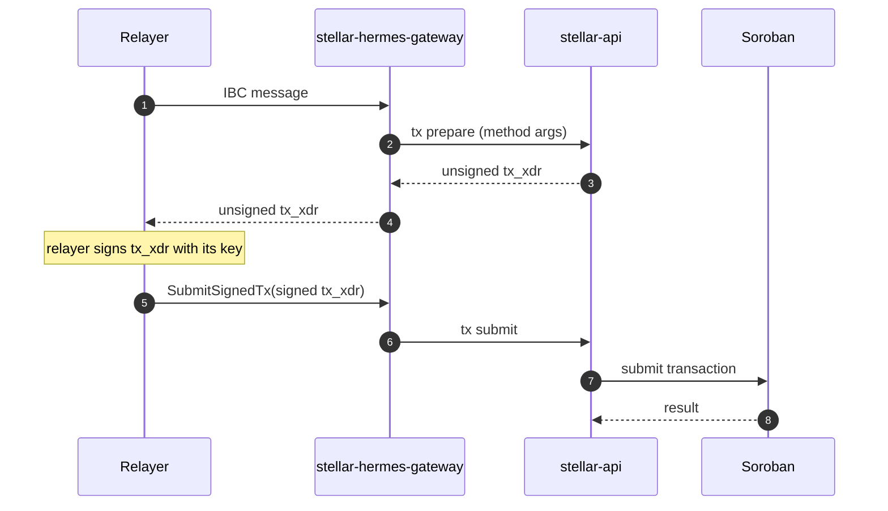
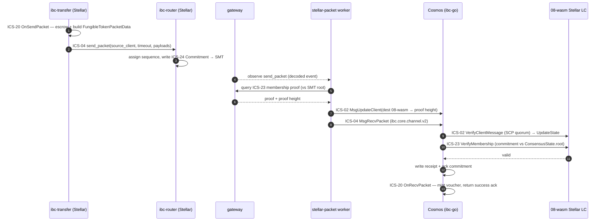
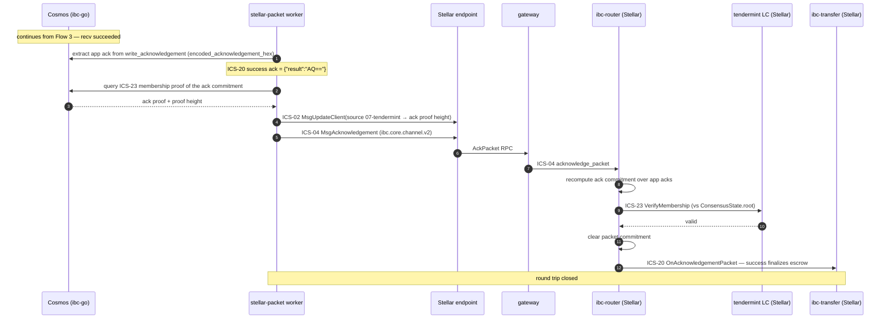
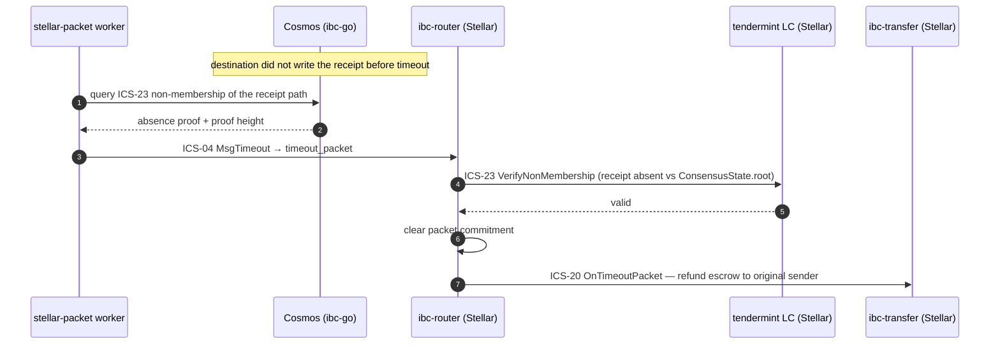

# Architecture

How the Stellar IBC v2 (Eureka) bridge is put together: the trust model, the
components and their responsibilities, the data flows that move a transfer across
chains, and how it all runs. Written for reviewers, integrators, and
contributors.

---

## 1. System overview

The bridge connects **Stellar** (Soroban smart contracts, SCP consensus) to any
**IBC-enabled chain**. The first counterparty is a Cosmos chain (ibc-go v10+ with
the `08-wasm` light-client module; the local devnet runs an ibc-go v11 `simd`);
the same machinery extends to Cardano and beyond.

The defining property is that **no component holds bridge funds or attests to
events off-chain.** Verification happens inside on-chain light clients. The
relayer, gateway, and api are untrusted transport.

### Trust model

IBC is trust-minimized because packet authenticity is checked by an **on-chain
light client of the source chain, running inside the destination chain**:

- A packet sent on chain A is committed to A's provable state.
- The relayer carries the packet plus a Merkle proof to chain B.
- Chain B's light client of A verifies the proof against a header it has already
  accepted from A. If the proof is valid, the packet is genuine.

There is no validator committee, no multisig federation, no off-chain signer set
that can be compromised to forge a transfer. The security of a packet equals the
security of the two underlying chains — nothing weaker.

| Role | Holds funds? | Holds keys? | Trusted for correctness? |
|---|---|---|---|
| `ibc-router` + light clients (on-chain) | escrow only | — | **yes** — this is the verification root |
| `stellar-api` | no | yes (relayer signing key) | no — only signs what the relayer asks |
| `stellar-hermes-gateway` | no | no | no — pure transport/encoding |
| Hermes relayer | no | yes (its own fee key) | no — a wrong/missing relay cannot forge a packet, only delay it |

A malicious relayer can censor or stall, but cannot mint, steal, or forge — the
on-chain light client rejects any packet without a valid proof.

### Provable state (IBC v2)

IBC v2 (Eureka) keeps only **three** provable paths — the packet lifecycle —
versus eight in v1. This is decisive on Stellar, where Soroban storage is
rent-priced per byte:

| Value | Path bytes |
|---|---|
| Packet Commitment | `{sourceClientId} \|\| 0x01 \|\| be64(sequence)` |
| Packet Receipt | `{destClientId} \|\| 0x02 \|\| be64(sequence)` |
| Acknowledgement Commitment | `{destClientId} \|\| 0x03 \|\| be64(sequence)` |

These live in a **deterministic fixed-depth-64 binary Sparse Merkle Tree (SMT)**,
chosen to be **Cardano-compatible** so the same proof format serves both
ecosystems. The SMT root is the `ConsensusState.root` that counterparty light
clients verify against. Proofs are serialized as ICS-23 `MerkleProof`s:
membership proves a commitment exists (recv / ack); non-membership proves a
receipt is absent (timeout). Because client / connection / channel state is not
provable in v2, the gateway's client/consensus/next-sequence queries
intentionally return `Unimplemented`.

Encoding details that had to match ibc-go exactly: the packet-commitment timeout
is hashed **big-endian** (`sha256(be64(timeout))`); the counterparty merkle prefix
is **empty** on the Cosmos side and `ibc` on the Stellar side; a membership proof
embeds the **value hash**, so the light client compares `proof_value ==
sha256(value)`; ICS-20 data is JSON `FungibleTokenPacketData` with
`version = "ics20-1"`, `encoding = "application/json"`.

### Multi-chain extensibility

The investment is **infrastructure, not a point bridge**. With *n* IBC chains,
custom bridges cost about n²/2 pairwise integrations; IBC costs *n* light clients
+ 1 shared protocol + 1 generalized relayer. The marginal cost of the next chain
is **one light client + one chain endpoint**. Once two non-Cosmos chains both
speak IBC they talk directly — no Cosmos chain in the middle — which yields the
`stellar ↔ cardano` and multi-hop forwarding routes on the roadmap.

### Status by ICS standard

Progress is tracked against the Interchain Standards this stack implements, not
against ad-hoc implementation phases.

| ICS standard | Scope in this bridge | State |
|---|---|---|
| **ICS-26 — Routing Module** | `ibc-router` dispatch and IBC v2 counterparty registration on both sides | done |
| **ICS-24 — Host Requirements** | commitment / receipt / ack paths in the provable SMT store | done |
| **ICS-02 — Client Semantics** | `07-tendermint` LC on Stellar and the Stellar `08-wasm` LC on Cosmos — create / update / verify | done; `08-wasm` verification proven on-chain |
| **ICS-23 — Vector Commitments** | ICS-23 membership / non-membership `MerkleProof`s over the SMT | membership verified on-chain (recv); non-membership (timeout) implemented |
| **ICS-04 — Packet Semantics** | `send` + `recv` verified (Stellar→Cosmos); `acknowledge` wired (pending an end-to-end test run); `timeout` implemented | in progress |
| **ICS-20 — Fungible Token Transfer** | escrow → relay → mint, `FungibleTokenPacketData` | Stellar→Cosmos proven on-chain; reverse (Cosmos→Stellar) next |

IBC v2 (Eureka) has no connection or channel handshake, so the v1 ICS-03
(Connection) and the handshake half of ICS-04 (Channel) do not apply — packet
semantics survive in ICS-04, counterparty wiring moves to ICS-26.

---

## 2. Components

The system splits into four layers: the Stellar on-chain protocol, the Stellar
off-chain services, the relayer, and the counterparty-side light client plus
orchestration.

### a. Stellar on-chain layer

| Component | Responsibility |
|---|---|
| **`ibc-router`** | The IBC v2 core on Stellar. Registers client types and counterparties, dispatches `send` / `recv` / `ack` / `timeout`, and owns the provable commitment / receipt / ack store (the SMT). |
| **`ibc-transfer`** | ICS-20 application. Escrows on send, credits/mints on recv, refunds on timeout or failed ack, and settles its state on a successful ack. Encodes and decodes `FungibleTokenPacketData`. |
| **light clients (`tendermint`, `attestation`, `mock`)** | Verify counterparty headers and membership proofs on Stellar. `tendermint` tracks a Cosmos chain; `mock` is always-accept for development; `attestation` is a roadmap variant. |
| **`stellar-ibc-core`** | Shared library underneath the contracts and services: the fixed-depth-64 SMT, the ICS-23 proof serializer, the IBC commitment paths, the client/consensus types and reverse codecs, the Soroban RPC client, and the HTTP `ApiClient`. |

### b. Stellar off-chain services

| Component | Responsibility |
|---|---|
| **`stellar-hermes-gateway`** | The gRPC service the relayer talks to (`StellarGatewayQuery` + `StellarGatewayMsg`). Holds **no** Soroban connection and **no** key — every call is fulfilled through `ApiClient` against `stellar-api`. Tracks the SMT root, produces ICS-23 proofs, and decodes Soroban router events into IBC-shaped attributes. |
| **`stellar-api`** | The standalone HTTP service that owns the Soroban RPC connection and the signing key. Builds unsigned transactions, submits signed transactions, and exposes ledger / account / event reads plus Cosmos-side governance and bank helpers. Splitting it from the gateway means the key lives in exactly one place and the gateway stays a stateless protocol adapter. |

### c. Relayer (Hermes fork)

| Component | Responsibility |
|---|---|
| **`StellarChainEndpoint`** | Implements Hermes's `ChainEndpoint` for Stellar: polls the gateway for events, builds IBC v2 messages, signs with the relayer key, submits via `SubmitSignedTx`, and queries clients / commitments / receipts / acks with proofs. |
| **`ics10-stellar` client types** | Stellar client / consensus state types and the v2 message encodings; unwraps the `08-wasm` envelope so the relayer can track the Stellar client on the counterparty like a native one. |
| **`stellar-packet` worker** | The custom v2 relay worker. IBC v2 has no channels, so it is **client-paired** rather than channel-paired; it drives recv, the ack-back leg, and timeout, carrying a proof source, client updater, and submitter for **each** direction. |

### d. Counterparty light client & orchestration

| Component | Responsibility |
|---|---|
| **`light-client-wasm`** | The **Stellar** light client, compiled to wasm and deployed on the counterparty via `08-wasm`. Verifies SCP `EXTERNALIZE` envelopes (Ed25519 from a quorum of trusted validators) and ICS-23 proofs against the Stellar SMT root. `08-wasm` lets any ibc-go v10+ chain host it without forking its binary. |
| **`eurekastellar` CLI** | The orchestrator: deploys contracts, uploads the wasm light client, creates clients, registers counterparties, runs the services, and originates transfers. |

#### Light clients verify in both directions

A bridge needs each chain to verify the other, so there are two light clients:

- **Cosmos → Stellar** — the `tendermint` LC on Soroban (`07-tendermint`) accepts
  the Cosmos client/consensus state, verifies header updates, and checks ICS-23
  membership proofs against the stored consensus root.
- **Stellar → Cosmos** — `light-client-wasm` via `08-wasm`. Its SCP model is
  deliberately **not** Tendermint-style — there is no ledger-hash continuity
  chain; SCP authenticity is the validator quorum, so it checks the
  `LedgerCloseValueSignature` (Ed25519 over the raw preimage
  `networkID ‖ ENVELOPE_TYPE_SCPVALUE ‖ txSetHash ‖ closeTime`) against the
  validator set seeded at client creation.

---

## 3. Data flows

Each flow is named with the Interchain Standards it exercises. The ICS operation
names are used directly: `send` / `recv` / `acknowledge` / `timeout` are ICS-04
(packet semantics); `OnSendPacket` / `OnRecvPacket` / `OnAcknowledgementPacket` /
`OnTimeoutPacket` are the ICS-26 routing callbacks into the ICS-20 application;
`VerifyClientMessage` / `UpdateState` are ICS-02 (client); `VerifyMembership` /
`VerifyNonMembership` are ICS-23 (commitments) over the ICS-24 host paths.

### Flow 1 — Counterparty registration · ICS-26 + ICS-24

IBC v2 replaces the v1 connection + channel handshake (8 messages) with a single
`RegisterCounterparty` per side, binding a local client to its counterparty
client id and **commitment (merkle) prefix** — the ICS-24 prefix under which that
counterparty stores its provable paths. On Stellar this is an `ibc-router` call;
on Cosmos it is `MsgRegisterCounterparty` (`ibc.core.client.v2`). The prefix is
`ibc` on the Stellar side and **empty** on the Cosmos side (Stellar SMT keys are
unprefixed). After both sides register, packets flow immediately — no version
negotiation, no port binding, no handshake.

### Flow 2 — Transaction model (prepare → sign → submit)

The transport mechanism beneath every ICS-26 message dispatch on the Stellar
side. Transactions are built where the chain connection lives (`stellar-api`) and
signed where the key lives (the relayer), but **driven** by the relayer, so the
gateway never holds a key. The relayer sends an IBC message to the gateway; the
gateway asks the api to prepare an unsigned `tx_xdr`; the relayer signs it and
hands it back; the gateway submits it through the api to Soroban. Preparation is
method-agnostic, so every ICS message — `create_client` (ICS-02),
`register_counterparty` (ICS-26), `recv_packet` / `acknowledge_packet` /
`timeout_packet` (ICS-04), `update_client` (ICS-02) — flows through one path.

### Flow 3 — Stellar → Cosmos transfer · ICS-20 send + ICS-04 recv

1. **ICS-20 send.** `ibc-transfer.initiate_transfer(...)` runs `OnSendPacket`:
   escrows the asset and builds the `FungibleTokenPacketData` (`version =
   "ics20-1"`, `encoding = "application/json"`).
2. **ICS-04 send.** `ibc-router.send_packet(source_client, timeout, payloads[])`
   assigns the sequence and writes the **Packet Commitment** to the ICS-24
   commitment path in the SMT (`sha256` over the canonical packet fields, with the
   timeout hashed **big-endian** to match ibc-go).
3. The relayer observes the `send_packet` event (the gateway decodes the Soroban
   event; the `stellar-packet` worker decodes the v2 packet) and queries the
   **ICS-23 membership proof** of the commitment from the gateway.
4. **ICS-02 client update.** ibc-go rejects a proof newer than the client, so the
   worker first builds `MsgUpdateClient` advancing the destination `08-wasm`
   client to the proof height, then `MsgRecvPacket` (`ibc.core.channel.v2`), and
   submits `[update, recv]` together to Cosmos.
5. **On-chain verification.** ibc-go runs the `08-wasm` Stellar LC:
   `VerifyClientMessage` (SCP `EXTERNALIZE` quorum signature) → `UpdateState`,
   then `VerifyMembership` (ICS-23 commitment proof vs `ConsensusState.root`). On
   success, ICS-04 writes the **receipt** + **acknowledgement commitment**, and
   the ICS-26 router invokes ICS-20 `OnRecvPacket`, which **mints the voucher** to
   the receiver and returns the success acknowledgement.

### Flow 4 — Ack-back leg · ICS-04 acknowledge + ICS-20 settle

The same worker chains straight into the acknowledgement direction so the source
commitment is cleared and the ICS-20 application settles:

1. **Extract the ack.** Read the application acknowledgement from the Cosmos
   recv-tx `write_acknowledgement` event — ibc-go v2 carries it as a proto
   `Acknowledgement { app_acknowledgements }` under `encoded_acknowledgement_hex`;
   for a successful ICS-20 recv the app ack is `{"result":"AQ=="}`.
2. Query the **ICS-23 membership proof** of the acknowledgement commitment from
   Cosmos (against its consensus root).
3. **ICS-02 client update.** Build `MsgUpdateClient` advancing the source
   `07-tendermint` client on Stellar to the ack proof height.
4. **ICS-04 acknowledge.** Build `MsgAcknowledgement` (`ibc.core.channel.v2`),
   routed through the Stellar endpoint → gateway `AckPacket` RPC →
   `ibc-router.acknowledge_packet`. The router recomputes the acknowledgement
   commitment over the app acks (`sha256` per ack, matching ibc-go), runs
   `VerifyMembership` via the `tendermint` LC, and **clears the packet
   commitment**.
5. **ICS-20 settle.** The ICS-26 router invokes ICS-20 `OnAcknowledgementPacket`:
   a success ack finalizes the escrow; a failure ack refunds it.

### Flow 5 — Timeout / refund · ICS-04 timeout + ICS-23 non-membership

If the destination never writes the receipt before the timeout, the relayer
proves **ICS-23 non-membership** of the receipt path (an absence proof against
the counterparty SMT root) and submits `timeout_packet` to the source
`ibc-router`. The router verifies the absence proof, clears the commitment, and
the ICS-26 router invokes ICS-20 `OnTimeoutPacket`, refunding the escrow to the
original sender.

> The reverse direction (Cosmos → Stellar) is symmetric: an ICS-20 `MsgTransfer`
> on Cosmos, ICS-04 `recv_packet` on the Stellar router (ICS-23 proof verified by
> the `tendermint` LC), ICS-20 mint/credit on Stellar, and the acknowledgement
> relayed back.

#### The gateway state tracker (why the ICS-23 proofs exist)

Every ICS-23 proof in Flows 3–5 depends on the gateway reconstructing the SMT at
a given height. The state tracker replays ledger close-meta **cumulatively**
(every ledger from the last processed up to the queried height, so the send
ledger's commitment write is ingested) and parses Soroban `TransactionMeta`
**V4** (the format the testnet emits). The proof is generated against the same
SMT root the `ConsensusState` carries, so the on-chain ICS-23 verify is
consistent.

---

## 4. Deployment and infrastructure

Everything is driven by the `eurekastellar` CLI. A full local bring-up:

```sh
eurekastellar cosmos start --fresh     # local Cosmos devnet (ibc-go v11 simd + 08-wasm)
eurekastellar start --force-redeploy   # deploy contracts, upload the wasm LC, import relayer keys
eurekastellar clients cosmos           # 07-tendermint client on Stellar
eurekastellar clients stellar          # 08-wasm Stellar client on Cosmos
eurekastellar clients counterparty stellar
eurekastellar clients counterparty cosmos
eurekastellar transfer                 # originate a Stellar → Cosmos ICS-20 transfer
```

The moving parts run as containers — the Cosmos chain, the gateway, the api, and
the Hermes relayer — composed with healthchecks and dependency ordering so each
service waits for its dependencies to be ready.

Because the whole stack is Rust (contracts, core, gateway, api, wasm light
client, and the Hermes fork), the relayer integration is debuggable end-to-end in
one toolchain. The relayer inherits Hermes's event loop, transaction queueing,
client refresh, fee estimation, key management, and configuration unchanged; only
the chain-specific `StellarChainEndpoint` and the v2 `stellar-packet` worker are
added. The relayer's compatibility gates are widened to admit the ibc-go v11
`simd`, and `AnyClientState` / `AnyConsensusState` route the wasm light-client
envelope to the Stellar parser so Hermes tracks the `08-wasm` client like a
native one.

---

## 5. Architecture diagrams

### Component topology



### Flow 1 — Counterparty registration · ICS-26 + ICS-24



### Flow 2 — Transaction model (prepare → sign → submit)



### Flow 3 — Stellar → Cosmos transfer · ICS-20 send + ICS-04 recv



### Flow 4 — Ack-back leg · ICS-04 acknowledge + ICS-20 settle



### Flow 5 — Timeout / refund · ICS-04 timeout + ICS-23 non-membership


